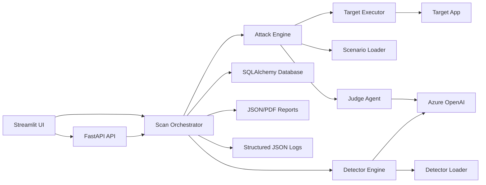

# Architecture

The architecture is intentionally modular. Scenario and detector plugins are loaded from the filesystem, the orchestrator is independent from the UI, and persistence uses SQLAlchemy models that can move from SQLite to PostgreSQL by changing `DATABASE_URL`.

Future distributed execution can attach a queue boundary between `ScanOrchestrator` and `AttackEngine`. Celery, Kafka, or Kubernetes Jobs can consume scan requests without changing detector or scenario plugin contracts.

